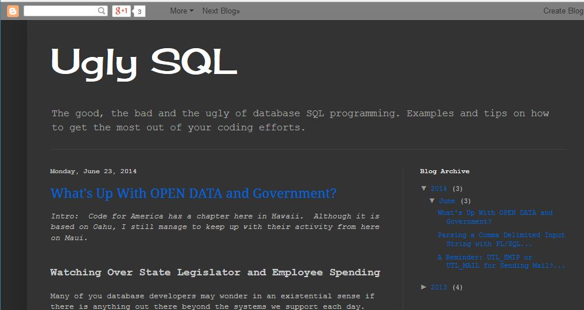

# Sample Work for _richpascual_

## Open Source Projects Authored:

**Oracle PL/SQL Exception Handler:**

This project was an adaption from a conceptual example first presented through an _O'Reilly Guide_ on the topic of programming reusable modules with PL/SQL.  I made this one on a locally hosted instance (my laptop) of Oracle Express (XE), although I have developed working variations of this code on the Enterprise Edition platform.

[Github Project:  ora-exception-handler](https://github.com/richardpascual/ora-exception-handler)

**_The Implementation (basic):_** A package with multiple output options for tracking errors encountered during the development process of PL/SQL blocks of code.  No need to trap for individual exception conditions as all standard PL/SQL "ORA-" based error conditions are accounted for dynamically.

        --
        -- **ora-exception-handler**: Usage Pattern Example 
		--
        
		DECLARE
		   ... Declarations Here
		   
		BEGIN
           ... BODY of your PL/SQL code here

        EXCEPTION
           WHEN Others THEN
              ERR_PKG.handle();  -- This is ALL!  The rest of the work is done by a relatively
			         -- small PL/SQL package.

        END;			  

It is a notable project because it has followed me to many of the Oracle shops I have worked in.  Each time, it has changed with more little improvements.  This project has been available as an _OpenSource_ project roughly as long as the **Github Community** has been online.  It has only been recently that I have revisited it to build on the additional improvements that have evolved over this time.

> See the results of a working demonstration:  [Exception Handler Demo](./demo-exception-handler.md)

**_The Implementation (advanced):_** Some enhancements are in the works.  At present, there are small hacks already present in the existing code which allows expanded, but currently undocumented functionality.  _More plans soon to bring things up to date!_

 

**The UGLYSQL Project:**

Paired with my professional blog of the same name, I use this as an ongoing and growing repository of sample data schemas and interesting examples of SQL and PL/SQL concepts or code blocks that solve difficult or unusual (i.e., "ugly") query requirements. 

[Github Repository:  Project UGLYSQL](https://github.com/richardpascual/uglysql) 
[Professional Blog @ UglySQL](http://uglysql.com) 

##Side Projects:  Current Websites Maintained##

I maintain multiple online blogs and websites on different platforms.  I customize the look and design of each blog, write or curate content sourced ethically with proper attribution and from sources with clear licensing rights.

In addition to managing the content of these pages, I also focus on experimenting with different avenues of site promotion, marketing and organic traffic "drivers".  Although I set up my sites for zero revenue streams (I do this for fun, not for profit), I do find the whole "net-popularity" aspect a fascinating super-cosm of your every-day high-school or college campus social network...

**The LOCALBIZGENIUS.COM**

My interest in online and offline marketing techniques targeting small and medium business development.  This blog is maintained using a new open-source platform known as [GHOST](http://ghost.org).  The original site template was an open source contribution and the images were photography samples sourced from my personal works or from _Creative Commons_ licensed photography posted on _Yahoo Flickr_.

[Roguish Mumbling:  The Localbizgenius](http://rogue.localbizgenius.com)

**I Want More Coffee**

Another dot-com project I developed.  Made instead on the `Google Blogger` Platform, the design is from a Google stock template with _Creative Commons_ sourced images.  The work is a mix of personal reflections on various topics (tagged:  **coffee-chat**) as well as edited and remixed content on the topics of coffee history, culture and folklore from around the world.  

> My first version of this site had nearly forty posts on researched content about coffee and its pervasive influences all around society, culture and even politics... until I mistakenly forgot to "pay the rent" on my website hosting contract.  Just a matter of a couple of weeks and everything was gone... :( Some of these hosting operators are absolutely ruthless!

Some personally filtered and edited work includes samples from purchased private-label (PLR) authored content.  Check it out.  Most of it is just yammering about various current-event style topics, but I'm sure to get back to the whole core concept about "coffee" itself pronto.  

[The coffee Blog: http://iwantmorecoffee.com](http://iwantmorecoffee.com)

##How I Help People With My Knowledge##

I am an active participant and editor of the knowledge-base, community resource _Stack Overflow_.  I concentrate on answering/solving problems submitted by other users in many areas of software development and programming.  A link to my profile is a great place to start, but if you want some examples from the 70+ solutions and user guides I have posted to date since the beginnning of this year.

[Stack Overflow Profile: ](http://stackoverflow.com/users/875701/richard-pascual)

**Some Sample Responses and Guides:**

_Oracle Application Express (APEX)_

1. [Converting PL/SQL Code to work with APEX page design elements](http://stackoverflow.com/questions/24633914/moving-from-oracle-web-toolkit-to-apex-4-2/24672200#24672200)

2. [Resolving login problems/Troubleshooting the APEX Listener](http://stackoverflow.com/questions/23942689/xml-db-login-on-apex-4-2/24006814#24006814)

3. [Overcoming the BLOB Object size limitation within Oracle APEX](http://stackoverflow.com/questions/22940521/apex-download-blob-from-temporary-table/22949484#22949484)

4. [Adding a Date Check Constraint/Validation in Oracle APEX](http://stackoverflow.com/questions/23856172/adding-date-check-constraint-in-apex/24044613#24044613)

5. [APEX List of Files Definition](http://stackoverflow.com/questions/22453859/apex-list-of-values-definition/23186506#23186506)

_Microsoft Access 2010 Alternate Solutions_

1. [Access 2010 Query Creation Problem](http://stackoverflow.com/questions/23228492/access-2010-doubling-the-sum-in-query/23234910#23234910)

_MySQL/SQL Problems_

This was a popular solution in my collection of contributions.  It shows how to use SQL to simulate a SCM tool's version tracking behavior.

1. [File Name Version Number Identification](http://stackoverflow.com/questions/22556856/increment-file-name-before-extension-by-1-in-the-database/22624154#22624154)

_Experimental PL/SQL Concepts_

This discussion from a response I posted to _Stack Overflow_ explored the idea of using a relational MySql database (or some other equivalent) to develop solutions that simulated the behavior of two dimensional spreadsheet layouts.

1. [Virtual Pivoted Data Sources](http://stackoverflow.com/questions/22126139/mysql-flexible-excel-like-structure/22188569#22188569)

